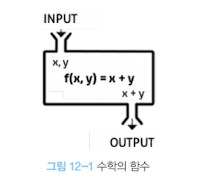
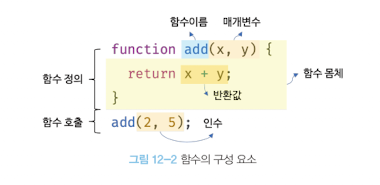
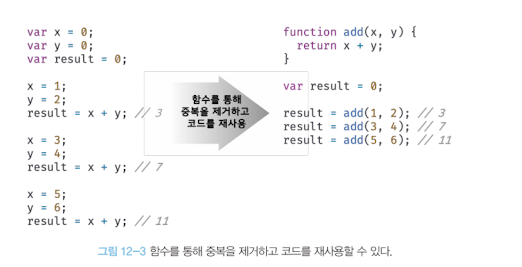
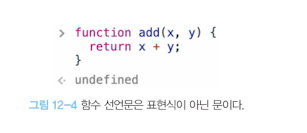

# 📖 12장. 함수

---

<br/>

---

### 1️⃣ 함수란?

- 자바스크립트에서 함수는 가장 중요한 핵심 개념입니다.
- 함수는 스코프, 실행 컨텍스트, 클로저, 생성자 함수에 의한 객체 생성, 메서드, this, 프로토타입, 모듈화 등이 모두 함수와 관련이 있습니다.

**예시**

- 다음은 수학의 함수를 “입력”을 받아 “출력”을 내보내는 일련의 과정으로 정의한 것입니다.
- `f(x,y) = x + y` 라는 함수를 정의하고 해당 함수에는 2개의 입력인 2와 5를 전달하며 함수는 x+y를 실행하여 7을 출력합니다.



- **이를 함수식으로 표현하면 `f(2,5) = 7`이며, 여기서 2,5는 입력에, 7은 함수의 실행결과인 출력을 의미합니다.**
- **이를 자바스크립트의 함수로 표현하면 다음과 같습니다.**

```jsx
//f(x,y)= x + y
function add(x,y){
  return x + y;
}

//f(2,5) = 7
add(2,5); //7
```

- **프로그래밍 언어의 함수는 일련의 과정을 문으로 구현하고, 코드 블록으로 감싸서 하나의 실행 단위로 정의한 것입니다. 프로그래밍 언어의 함수도 입력을 받아서 출력을 내보냅니다.**
- **이때 함수 내부로 입력을 전달받는 변수를 매개변수, 입력을 인수, 출력을 반환값 이라고 합니다. 또한 함수는 값이며, 여러 개 존재할 수 있으므로 특정 함수를 구별하기 위해 식별자인 함수 이름을 사용할 수 있습니다.**



- 함수는 함수 정의를 통해서 생성합니다. 자바 스크립트의 함수는 다양한 방법으로 정의할 수 있습니다.

**예시**

```jsx
//함수 정의
function add(x,y){
  return x + y;
}
```

- 함수의 정의만으로 함수가 실행되는 것은 아닙니다. 수학의 함수처럼 미리 정의된 일련의 과정을 실행하기 위한 입력, 즉 인수를 매개변수를 통해서 함수에 전달하면서 함수의 실행을 지시해야 합니다.

→ 이를 **함수 호출**이라고 합니다.

- 함수를 호출하면 코드 블록에 담긴 문들이 일괄적으로 실행되고, 실행 결과인 반환값을 반환합니다.

```jsx
//함수 호출
var result = add(2,5);

//함수 add에 인수 2,5를 전달하면서 호출하면 반환값 7을 반환합니다.
console.log(result);
```

### 2️⃣ 함수를 사용하는 이유

- 함수는 필요할 때 여러번 호출할 수 있습니다. 즉, 실행시점을 개발자가 결정할 수 있고, 몇번이든 재사용이 가능합니다.
- **동일한 작업을 반복적으로 수행한다면 함수를 재사용하여 사용하는 것이 효율적입니다.**



- 함수를 사용하지 않고 중복된 코드를 여러번 작성하면 수정시 중복 횟수만큼 코드를 수정해야 합니다. 또한 중복된 코드에서 실수할 가능성도 높습니다.
- **이에 함수는 코드의 중복을 억제하고 재사용성을 높이며 유지보수의 편의성을 높이고 실수를 줄여 코드의 신뢰성을 높이는 효과가 있습니다.**

- **자바스크립트에서는 함수는 객체 타입으로 다루어집니다.**

→ **따라서 이름을 붙일 수도 있으며, 함수의 이름은 변수의 이름과 마찬가지로 함수 자신의 역할을 잘 설명해야 합니다.**

**→ 적절한 함수 이름은 함수의 내부 코드를 이해하지 않고도 함수의 역할을 파악할 수 있게 돕기 때문에, 이는 코드의 가독성을 향상시킵니다.**

### 3️⃣ 함수 리터럴

- **자바스크립트의 함수는 객체 타입의 값입니다.**

→ 따라서 숫자 값을 숫자 리터럴로 생성하고, 객체를 객체 리터럴로 생성하는 것처럼 함수도 함수 리터럴로 생성할 수 있습니다.

- **함수 리터럴은 `function` 키워드, 함수 이름, 매개변수 목록, 함수 몸체로 구성됩니다.**

```jsx
//변수에 함수 리터럴을 할당
var f = function add(x,y){
  return x + y;
}
```

**👉🏻 함수 리터럴의 구성요소**

| 구성 요소 | 설명 |
| --- | --- |
| 함수 이름 | - 함수 이름은 식별자다. 따라서 식별자 네이밍 규칙을 준수해야 한다.
- 함수 이름은 함수 몸체 내에서만 참조할 수 있는 식별자다.
- 함수 이름은 생략할 수 있다. 이름이 있는 함수를 기명 함수, 이름이 없는 함수를 무명/익명 함수라고 합니다. |
  | 매개변수 목록 | - 0개 이상의 매개변수를 소괄호로 감싸고 쉽표로 구분합니다.
- 각 매개변수에는 함수를 호출할 때, 지정한 인수가 순서대로 할당됩니다. 즉, 매개변수 목록은 순서에 의미가 있습니다.
- 매개변수는 함수 몸체 내에서 변수와 동일하게 취급됩니다. 따라서 매개변수도 변수와 마찬가지로 식별자 네이밍 규칙을 준수해야 합니다. |
  | 함수 몸체 | - 함수가 호출되었을 때, 일괄적으로 실행될 문들을 하나의 실행 단위로 정의한 코드 블록입니다.
- 함수 몸체는 함수 호출에 의해 실행됩니다. |

- **위의 예제를 통해서 함수 리터럴을 변수에 할당하고 있습니다.**

**🔎 리터럴**

- 리터럴은 사람이 이해할 수 있는 문자 또는 약속된 기호를 사용하여 값을 생성하는 표기 방식을 의미합니다.

→ 즉, 리터럴은 값을 생성하기 위한 표기법입니다.

- 따라서 함수 리터럴도 평가되어 값이 변수에 할당되게 됩니다.

**→ 자바스크립트에서는 함수는 객체라는 것을 알 수 있습니다.**

**⚠️ 주의해야 할 점**

- 함수는 객체지만, 일반 객체와는 다릅니다.

**→ 일반 객체는 호출할 수 없지만, 함수는 호출할 수 있습니다. 또한, 일반 객체에는 없는 함수 객체만의 고유한 프로퍼티를 가질 수 있습니다.**

### 4️⃣ 함수 정의

- **함수의 정의란 함수를 호출하기 이전에 인수를 전달받을 매개변수와 실행할 문들, 그리고 반환할 값을 지정하는 것을 의미합니다.**

**→ 정의된 함수는 자바스크립트 엔진에 의해 평가되어 함수 객체가 됩니다.**

**🔎 함수를 정의하는 4가지 방법**

- **모든 함수의 정의 방식은 함수를 정의한다는 면에서는 동일합니다. 다만, 조금은 미묘하지만 차이가 있습니다.**

| 함수 정의 방식 | 예시 |
| --- | --- |
| 함수 선언문 | function add(x,y){
return x + y;
} |
| 함수 표현식 | var add = function (x,y){
return x + y;
}; |
| Function 생성자 함수 | var add = new Function( ‘x’, ‘y’, ‘return x + y’); |
| 화살표 함수 | var add = (x,y) ⇒ x + y; |

**👩🏻‍🏫 참고**

- **변수는 선언한다고 하지만 함수는 정의한다고 합니다.**

**→ 함수 선언문이 평가되면, 식별자가 암묵적으로 생성되고, 함수 객체가 할당됩니다.**

1. **함수 선언문**
- 함수 선언문을 사용하여 함수를 정의하는 방식은 다음과 같습니다.

```jsx
//함수 선언문
function add(x,y) {
  return x + y;
}

//함수 참조
//console.dir은 console.log와는 달리 함수 객체의 프로퍼티까지 출력합니다.
console.dir(add); //f add(x,y)

//함수 호출
console.log(add(2,5));
```

- 함수 선언문은 함수 리터럴과 형태가 동일합니다.

**→ 단, 함수 리터럴은 함수 이름을 생략할 수 있으나, 함수 선언문은 함수 이름을 생략할 수 없습니다.**

**💣 불가능**

```jsx
//함수 선언문은 함수 이름을 생략할 수 없습니다.
function (x, y) {
  return x + y;
}
//Syntax에러 발생
```

- **함수 선언문은 표현식이 아닌 문입니다.**

**→ 때문에 크롬에서 개발자 도구의 콘솔에 함수 선언문을 실행하면 `undefind`가 출력됩니다.**

**→ 만약 함수 선언문이 표현식인 문이라면, 완료 값 `undefined` 대신 표현식이 평가되어 생성된 함수가 출력되어야 합니다.**



**⚠️ 주의해야 할점**

- **표현식이 아닌 문은 변수에 할당할 수 없습니다.**

→ 함수 선언문도 표현식이 아닌 문이므로 변수에 할당할 수 없습니다.

- 그러나 다음의 예제를 실행해보면 함수 선언문이 변수에 할당되는 것처럼 보입니다.

```jsx
//함수 선언문은 표현식이 아닌 문이므로 변수에 할당할 수 없다.
//하지만 함수 선언문이 변수에 할당되는 것처럼 보인다.
var add = function add(x,y){
  return x + y;
};

//함수 호출
console.log(add(2,5)); //7
```

**👩🏻‍🏫 설명**

- **이렇게 동작하는 이유는 자바스크립트 엔진이 코드의 문맥에 따라 동일한 함수 리터럴을 표현식이 아닌 문인 함수 선언문으로 해석하는 경우 및 표현식인 함수 리터럴 표현식으로 해석하는 경우가 있기 때문입니다.**

→ **이는 함수 이름이 있는 기명 함수 리터럴은 함수 선언문 또는 함수 리터럴  표현식으로 해석될 가능성이 있다는 의미입니다.**

1. **함수 표현식**
- 자바스크립트의 함수는 객체 타입의 값이므로, 변수에 할당할 수도 있고 프로퍼티 값이 될수도 있으며 배열의 요소가 될 수도 있습니다.

**→ 이처럼 값의 성질을 갖는 객체를 일급 객체라고 합니다.**

- **자바 스크립트의 함수는 일급 객체입니다.**

**→ 함수가 일급 객체라는 것은 함수를 값ㅊ터럼 자유롭게 사용할 수 있다는 의미입니다.**

- **함수는 일급 객체이므로, 함수 리터럴로 생성한 함수 객체를 변수에 할당할 수 있으며, 이러한 함수 정의 방식을 함수 표현식이라고 합니다.**

**예시**

```jsx
//함수 표현식
var add = function (x,y){
  return x + y;
};

console.log(add(2,5)); //7
```

- 함수 리터럴의 함수 이름은 생략할 수 있습니다.

**→ 이러한 함수를 익명함수라고 합니다.**

→ **함수 표현식의 함수 리터럴은 함수 이름을 생략하는 것이 일반적입니다.**

- **함수 선언문에서 살펴본 것과 같이 함수를 호출할 때는 함수 이름이 아닌 함수 객체를 가리키는 식별자를 사용해야 합니다.**

**→ 함수 이름은 함수 몸체 내부에서만 유효한 식별자이므로, 함수 이름으로 함수를 호출할 수 없습니다.**

```jsx
//기명 함수 표현식
var add = function foo(x,y){
  return x + y;
};

//함수 객체를 가리키는 식별자로 호출
console.log(add(2,5)); //7

//함수 이름으로 호출하면 ReferenceError가 발생한다.
//함수 이름은 함수 몸체 내부에서만 유요한 식별자다.
console.log(foo(2,5)); //ReferenceError: foo is not defined
```

1. **함수 생성 시점과 함수 호이스팅**

**예시**

```jsx
//함수 참조
console.dir(add); //f add(x,y)
console.dir(sub); //undefined

//함수 호출
console.log(add(2,5)); //7
console.log(sub(2,5)); //TypeError: sub is not a function

//함수 선언문
function add(x,y){
  return x + y;
}

//함수 표현식
var sub = function (x,y){
  return x - y;
}
```

- **위와 같은 예제는 함수 선언문으로 정의한 함수는 함수 선언문 이전에 호출할 수 있다.**
- **그러나 함수 표현식으로 정의한 함수는 함수 표현식 이전에 호출할 수 없다.**

**→ 이는 함수 선언문으로 정의한 함수와 함수 표현식으로 정의한 함수의 생성 시점이 다르기 때문입니다.**

1. **Function 생성자 함수**
- 자바스크립트가 기본 제공하는 빌트인 함수인 `Function` 생성자 함수에 매개변수 목록과 함수 몸체를 문자열로 전달하면서 `new` 연산자와 함께 호출하면 함수 객체를 생성해서 반환합니다.

→ 사실 `new` 연산자 없이 호출해도 결과는 동일합니다.

**🔎 생성자 함수**

- **생성자 함수는 객체를 생성하는 함수를 의미합니다.**

**예시**

```jsx
var add = new Function('x','y','return x + y');
console.log(add(2,5)); //7
```

- Function 생성자 함수로 함수를 생성하는 방식은 일반적이지 않으며, 바람직하지도 않습니다.

→ Function 생성자 함수로 생성한 함수는 클로저를 생성하지 않는 등, 함수 선언문이나 함수 표현식으로 생성한 함수와 다르게 동작합니다.

**예시**

```jsx
var add1 = (function (){
  var a = 10;
  return function (x,y){
    return x + y + a;
  };
}());

console.log(add1(1,2)); //13

var add2 = (function (){
  var a = 10;
  return new Function('x','y','return x + y + a');
}());

console.log(add2(1,2)); //ReferenceError: a is not defined
```

- **클로저는 아직 살펴보지 않은 내용이여서, 함수 선언문이나 함수 표현식으로 생성한 함수와 `Function` 생성자 함수로 생성한 함수가 동일하게 동작하지 않는데 주목합시다.**

1. **화살표 함수**
- ES6에서 도입된 화살표 함수는 functiuon 키워드 대신 화살표 ⇒를 사요앟여 좀 더 간략한 방법으로 함수를 선언할 수 있습니다.

**→ 화살표 함수는 항상 익명 함수로 정의합니다.**

```jsx
//화살표 함수
const add = (x,y) => x + y;
console.log(add(2,5)); //7
```

- **화살표 함수는 기존의 함수 선언문 또는 함수 표현식을 완전히 대체하기 위해 디자인 된 것은 아닙니다. 화살표 함수는 기존의 함수보다 표현만 간략한 것뿐만 아닌, 내부 동작 또한 간략적으로 되어 있습니다.**

**⚠️ 주의점**

- **화살표 함수는 생성자 함수로 사용할 수 없으며, 기존 함수와 `this` 바인딩 방식이 다르고 `prototype` 프로퍼티가 없으며 `arguments` 객체를 생성하지 않습니다.**

### 5️⃣ 함수 호출

1. **매개변수와 인수**

1. **인수 확인**

1. **매개변수의 최대 개수**

1. **반환문**

### 6️⃣ 참조에 의한 전달과 외부 상태의 변경

### 7️⃣ 다양한 함수의 형태

1. **즉시 실행 함수**

1. **재귀함수**

1. **중첩 함수**

1. **콜백 함수**

1. **순수 함수와 비순수 함수**

