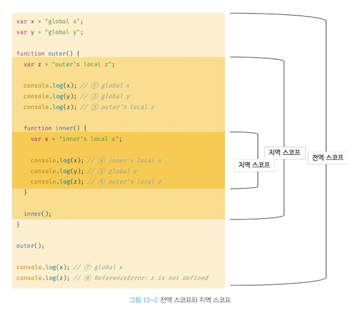

# 📖 13장. 스코프

---

<br/>

### 1️⃣ 스코프란?

- 자바스크립트의 스코프는 다른언어의 스코프와 구별되는 특징이 있습니다.
- **그리고 `var` 키워드로 선언한 변수와 `let` 또는 `const` 키워드로 선언한 변수의 스코프도 다르게 동작합니다.**
- 그리고 스코프는 변수뿐만 아닌 함수와도 깊은 관련성이 있습니다.
- 함수의 매개변수는 함수 몸체 내부에서만 참조할 수 있고, 함수 몸체 외부에서는 참조할 수 없음을 확인했습니다.

**→ 해당 부분은 매개변수를 참조할 수 있는 유효범위, 즉 매개변수의 스코프가 함수 몸체 내부로 한정되기 때문입니다.**

```jsx
function add(x,y){
  //매개변수는 함수 몸체 내부에서만 참조할 수 있다.
  //즉, 매개변수의 스코프(유효범위)는 함수 몸체 내부입니다.
  console.log(x,y); // 2 5
  return x + y;
}

add(2,5);

//매개변수는 함수 몸체 내부에서만 참조할 수 있습니다.
console.log(x,y); //ReferenceError: x is not defined
```

- 변수는 코드의 가장 바깥 영역뿐만 아닌 코드 블록이나 함수 몸체 내에서도 선언할 수 있습니다.

→ 이때 코드 블록이나 함수는 중첩될 수 있습니다.

```jsx
var var1 = 1; //코드의 가장 바깥 영역에서 선언한 변수

if(true){
  var var2 = 2; //코드 블록 내에서 선언한 변수
  if(true){
    var  var3 = 3; //중첩된 코드 블록 내에서 선언한 변수
  }
}

function  foo(){
  var var4 = 4; //함수 내에서 선언한 변수
  
  function bar(){
    var var5 = 5; //중첩된 함수 내에서 선언한 변수
  }
}

console.log(var1); //1
console.log(var2); //2
console.log(var3); //3
console.log(var4); //ReferenceError
console.log(var5); //ReferenceError
```

- **변수는 자신이 선언된 위치에 의해 자신이 유효한 범위, 즉 다른 코드가 변수 자신을 참조할 수 있는 범위가 결정됩니다.**
- **변수뿐만 아닌 모든 식별자가 그렇습니다.**

**→ 모든 식별자(변수 이름, 함수 이름, 클래스 이름 등)은 자신이 선언된 위치에 의해 다른 코드가 식별자 자신을 참조할 수 있는 유효 범위가 결정됩니다.**

**→ 이를 스코프라고 합니다. 즉 스코프는 식별자가 유효한 범위를 의미합니다,.**

**예시**

- 자바 스크립트 엔진은 이름이 같은 2개의 변수 중, 어떤 변수를 참조해야 할 것인지 결정합니다.

**→ 이를 식별자 결정이라고 합니다.**

- 자바스크립트 엔진은 스코프를 통해 어떤 변수를 참조해야 할 것인지 결정합니다.

**→ 따라서 스코프란 자바스크립트 엔진이 식별자를 검색할 때 사용하는 규칙이라고도 할 수 있습니다.**

```jsx
var x = 'global';

function foo(){
  var x = 'local';
  console.log(x); //1번 - local
}

foo()
console.log(x); //2번 - global
```

### 2️⃣ 스코프의 종류

- **코드는 전역과 지역으로 나누어 구분할 수 있습니다.**

| 구분 | 설명 | 스코프 | 변수 |
| --- | --- | --- | --- |
| 전역 | 코드의 가장 바깥 영역 | 전역 스코프 | 전역 변수 |
| 지역 | 함수 몸체 내부 | 지역 스코프 | 지역 변수 |
- 이때, 변수는 자신이 선언된 위치에 의해 자신이 유효한 범위인 스코프가 결정됩니다. 즉, 전역에서 선언된 변수는 전역 스코프를 갖는 전역 변수이고, 지역에서 선언된 변수는 지역 스코프를 갖는 지역 변수입니다.

1. **전역과 전역 스코프**
- 전역이란 코드의 가장 바깥 영역을 의미합니다.
- **전역에서 변수를 선언하면 전역 변수가 되며, 전역 변수는 어디서든지 참조할 수 있습니다.**



1. **지역과 지역 스코프**
- **지역이란 함수 몸체 내부를 의미하며, 지역 스코프를 만듭니다.**
- **지역에 변수를 선언하면 지역 스코프를 갖는 지역변수가 되며, 지역변수는 자신의 지역 스코프와 하위 지역 스코프에서 유효합니다.**

### 3️⃣ 스코프 체인

1. **스코프 체인에 의한 변수 검색**

1. **스코프 체인에 의한 함수 검색**

### 4️⃣ 함수 레벨 스코프

- **지역은 함수 몸체 내부를 말하고, 지역은 지역 스코프를 만든다고 했습니다.**

**→ 이는 코드 블록이 아닌 함수에 의해서만 지역 스코프가 생성된다는 의미입니다.**

- C나 자바 등의 대부분 프로그래밍 언어는 함수 몸체뿐만아닌 모든 코드 블록(if,for,while,try/catch 등)이 지역 스코프를 만듭니다.

**→ 이러한 특성을 블록 레벨 스코프라고 합니다.**

- **하지만, var 키워드로 선언된 변수는 오로지 함수의 코드 블록(함수 몸체)만 지역 스코프로 인정합니다.**

**→  이러한 특성을 함수 레벨 스코프라고 합니다.**

- **var키워드가 먼저 전역변수로 선언되고 이후, 함수 내부에서 지역변수로 선언되었다고 하더라도 전역변수로 처리가 됨**

```jsx
var x = 1;

if(true){
  //var 키워드로 선언된 변수는 함수의 코드 블록(함수 몸체)만ㄴ을 지역 스코프로 인정하ㅣㄴ다.
  //함수 밖에서 var 키워드로 선언된 변수는 코드 블록 내에서 선언되었다 할지라도 모두 전역 변수입니다.
  //따라서 x는 전역변수입니다. 이미 선언된 전역 변수 x가 있으므로 x변수는 중복 선언됩니다.
  var x = 10;
}

console.log(x); //10
```

```jsx
var i = 10;

//for문에서 선언한 i는 전역 변수입니다. 이미 선언된 전역 변수 i가 있으므로 중복 선언됩니다.
for(var i = 0; i<5;i++){
  console.log(i); //0,1,2,3,4
}

//의도치 않게 변수의 값이 변경되었다.
console.log(i); //5
```

### 5️⃣ 렉시컬 스코프

**예제**

```jsx
var x = 1;

function foo(){
  var x = 10;
  bar();
}

function bar(){
  console.log(x);
}

foo();
bar();
```

- 위의 예제의 실행 결과는 bar 함수의 상위 스코프가 무엇인지에 따라서 결정됩니다. 이는 2가지 패턴으로 예측할 수 있습니다.
1. 함수를 어디서 호출했는지에 따라 함수의 상위 스코프를 결정한다.
2. 함수를 어디서 정의했는지에 따라 함수의 상위 스코프를 결정한다.

- 자바스크립트는 레시컬 스코프를 따르므로 함수를 어디서 호출했는지가 아닌 함수를 어디서 정의했는지에 따라 상위 스코프를 결정합니다.
- 함수가 호출된 위치는 상위 스코프 결정에 어떠한 영향도 주지않습니다.

→ 즉, 함수의 상위 스코프는 언제나 자신이 정의된 스코프입니다.