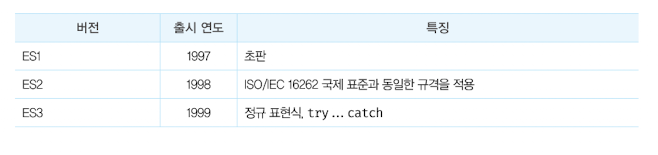
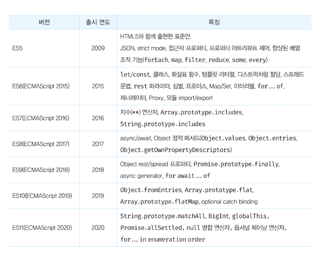
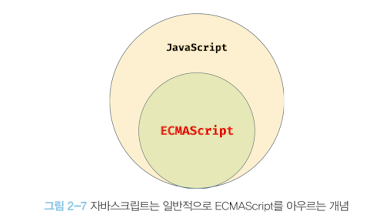
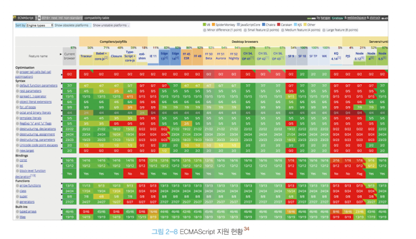

# 📖 2장. 자바 스크립트란?

---

 

### 1️⃣ 자바스크립트의 탄생

- 1995년, 90% 점유율로 웹 브라우저 시장을 지배하고 있던 넷스케이프 커뮤니케이션즈는 웹 페이지의 보조적인 기능을 수행하기 위해 브라우저에서 동작하는 경량 프로그램을 도입하였습니다.
- 이에 브렌던 아이크가 만들어 탄생한 언어가 **“자바스크립트”**입니다.
- **자바스크립트는 1996년 3월에 넷스케이프의 웹 브라우저에 탑재되었고, “모카”로 이름 붙여 발명되었습니다. 그러다가 1996년 9월 “라이브스크립트”로 명칭을 바꾸고 12월에는 “자바스크립트”라는 이름으로 변경되었습니다.**
- 그러나 자바스크립트가 탄생된지 얼마되지 않아 자바스크립트의 파생 버전인 **“JScript”**가 출시되어 위험을 받았습니다.

### 2️⃣ 자바스크립트의 표준화

- 1996년 8월, MS는 “JScript”를 익스플로우에 탑재했습니다. JScript와 자바스크립트는 표준화되지 못하고 적당히 호환되었습니다.
- **이에 브라우저에 따라 웹 페이지가 정상적으로 동작하지 않는 “크로스 브라우징 이슈”가 발생하기 시작했고, 모든 브라우저에서 정상적으로 동작하는 웹 페이지를 개발하기가 어려워졌습니다.**
- **이에 넷스케이프 회사는 ECMA 인터내셜에 자바스크립트의 표준화를 요청하여 ECMAScript로 이름이 명명된 후, 표준사항이 만들어졌습니다.**

### 3️⃣ 자바스크립트 성장의 역사

- **초창기 자바스크립트는 웹페이지의 보조적인 기능을 수행하기 위한 한정적인 용도로 사용되었습니다. 해당시기의 대부분의 로직은 주로 웹 서버에서 실행이 되었고, 브라우저는 서버로부터 전달받은 HTML과 CSS를 단순히 렌더링하는 수준이였습니다.**

**👉🏻 렌더링이란?**

- **HTML, CSS, 자바스크립트로 작성된 문서를 해석해서 브라우저에 시각적으로 출력하는 것을 의미합니다.**
- **때로는 서버에서 데이터를 HTML로 변환하여 브라우저에게 전달하는 과정(SSR:Server Side Rendering)을 가리키기도 합니다.**

1. **Ajax**
- **자바스크립트를 이용하여 서버와 브라우저가 비동기 방식으로 데이터를 교환할 수 있는 통신인 `Ajax` 가 `XMLHttpRequest` 라는 이름으로 등장하였습니다.**
- 이전의 웹 페이지는 html 태그로 시작하여 html 태그로 끝나는 완전한 HTML 코드를 서버로부터 전송받아 웹페이지 전체를 렌더링하는 방식으로 동작했습니다.

→ 따라서 화면이 전환되면 서버로부터 새로운 HTML을 전송받아 웹페이지 전체를 처믕부터 다시 렌더링해야 했습니다.

- 해당 방식은 변경할 필요가 없는 부분까지 포함된 HTML 코드를 서버로부터 다시 전송받기 때문에 불필요한 데이터 통신이 발생하고, 변경할 필요가 없는 부분까지 처음부터 다시 렌더링해야 하기 때문에 성능면에서 불리합니다.
- **반면 `Ajax` 는 웹페이지에서 변경할 필요가 없는 부분은 다시 렌더링하지 않고, 서버로부터 필요한 데이터만 전송받아 변경해야 하는 부분만 한정적으로 렌더링하는 방식이 가능하게 했습니다.**

1. **jQuery**
- **2006년, `jQuery`는 `Dom` 을 쉽게 제어할 수 있게 되었고, 크로스 브라우징 이슈도 어느정도 해결하였습니다.**

1. **V8 자바스크립트 엔진**
- 구글의 V8 자바스크립트 엔진은 데스크톱 애플리케이션과 유사한 사용자 경험을 제공할 수 있는 웹 어플리케이션 프로그래밍 언어로 정착하게 되었습니다.
- **V8 자바스크립트 엔진은 구글이 개발한 오픈 소스 자바스크립트 엔진이며 크롬 웹 브라우저와 Node.js 런타임 환경에서 사용됩니다.**
- **V8은 자바스크립트 코드를 실행하기 위해 설계되었으며, 특히 빠른 성능을 제공하는 것으로 유명합니다.**

👉🏻 **V8의 주요 기능 및 특징**

- **고성능: V8은 자바스크립트 코드를 기계어 코드로 컴파일하여 실행 속도를 극대화합니다. 이를 위해 Just-In-Time (JIT) 컴파일러를 사용합니다.**
- **최적화: 코드의 실행 패턴을 분석하여 최적화를 수행합니다. 이로 인해 반복적으로 실행되는 코드가 더 빠르게 동작할 수 있습니다.**
- **메모리 관리: 가비지 컬렉션을 통해 메모리를 효율적으로 관리합니다. V8은 메모리 사용을 최소화하면서도 성능을 유지하는 데 중점을 둡니다.**
- **멀티 플랫폼 지원: V8은 다양한 운영 체제와 플랫폼에서 동작하도록 설계되었습니다. 이는 V8이 다양한 환경에서 일관된 성능을 제공할 수 있음을 의미합니다.**
- **V8 엔진 덕분에 자바스크립트는 서버 사이드 프로그래밍에서도 널리 사용되며, 웹 브라우저를 넘어 다양한 애플리케이션 개발에 활용되고 있습니다.**

1. **Node.js**
- **Node.js는 구글 V8 자바스크립트 엔진으로 빌드된 자바스크립트 런타임 환경입니다.**
- **Node.js는 브라우저의 자바스크립트 엔진에서만 동작하던 자바스크립트를 브라우저 이외의 환경에서도 동작할 수 있도록 자바스크립트 엔진을 브라우저에서 독립시킨 자바스크립트 실행환경입니다.**
- Node.js는 주로 서버 사이드 어플리케이션 개발에 사용되며, 이에 필요한 모듈, 파일 시스템, HTTP 등 빌트인 API를 제공합니다.
- Node.js는 비동기 I/O를 지원하며 단일 스레드 이벤트 루프 기반으로 동작함으로써 요청처리 성능이 좋습니다.

**→ 따라서 Node.js는 데이터를 실시간으로 처리하기 위해 I/O가 빈번하게 발생하는 SPA에 적합합니다. 하지만 CPU 사용률이 높은 어플리케이션에는 권장하지 않습니다.**

1. **SPA 프레임워크**
- **현대의 웹 페이지는 데스크톱 어플리케이션, 모바일과 비슷한 성능과 사용자 경험을 제공하는 것이 필수가 되었고, 개발의 규모와 복잡도가 상승했습니다.**
- **이에 많은 프레임워크가 등장하였으며, CBD 방법론을 기반으로 하는 SPA가 대중화되어 React,Vue.js, Svelte 등의 다양한 SPA 프레임워크/라이브러리 가 등장하였습니다.**

### 4️⃣ 자바스크립트와 ECMAScript

- **`ECMAScript`는 자바스크립트의 표준 사양인 `ECMA-262`를 의미하며, 자바스크립트의 핵심 문법을 규정합니다.**
- **이에 각 브라우저는 `ECMAScript` 사양을 준수하여 브라우저에 내장되는 자바스크립트 엔진을 구현합니다.**
- **자바스크립트는 일반적으로 프로그래밍 언어로써 기본 뼈대를 이루는 `ECMAScript` 와 브라우저가 별도로 지원하는 클라이언트 사이드 `Web API` 등을 아우르는 개념입니다.**

**👉🏻 클라이언트 사이드 Web API**

- **ECMA와는 별도로 W3C에서 별도로 사양을 관리하고 있습니다.**

### 5️⃣ 자바스크립트의 특징

- 자바스크립트는 HTML, CSS와 함께 웹을 구성하는 요소 중 하나로 **웹 브라우저에서 동작하는 유일한 프로그래밍 언어**입니다.
- **자바 스크립트는 개발자가 별도의 컴파일 작업을 수행하지 않는 인터프리터 언어입니다.**
- **인터프리터 언어는 소스코드를 즉시 실행하고 컴파일러는 빠르게 동작하는 머신코드를 생성하고 최적화합니다.**

**👉🏻 인터프리터 언어 vs 컴파일 언어 비교**

| 컴파일러 언어 | 인터프리터 언어 |
| --- | --- |
| 코드가 실행되기 전 단계인 컴파일 타임에 소스코드 전체를 한번에 머신 코드로 변환한 후 실행합니다. | 코드가 실행되는 단계인 런타임에 문 단위로 한 줄씩 중간 코드인 바이트 코드로 변환한 후 실행합니다. |
| 실행 파일을 생성합니다. | 실행 파일을 생성하지 않습니다. |
| 컴파일 단계와 실행 단계가 분리되어 있습니다. 명시적인 컴파일 단계를 거치고, 명시적으로 실행 파일을 실행합니다. | 인터프리터 단계와 실행 단계가 분리되어 있지 않습니다.
인터프리터는 한 줄씩 바이트코드로 변환하고 즉시 실행합니다. |
| 실행에 앞서 컴파일은 단 한번 수행됩니다. | 코드가 실행될 때마다 인터프리터 과정이 반복 수행됩니다. |
| 컴파일과 실행 단계가 분리되어 있으므로, 코드 실행 속도가 빠릅니다. | 인터프리터 단계와 실행 단계가 분리되어 있지 않고, 반복수행되므로 코드 실행 속도가 비교적 느립니다. |

- **자바스크립트는 명령형, 함수형, 프로토타입 기반 객체지향 프로그래밍을 지원하는 멀티 패러다임 프로그래밍 언어입니다.**
- **다른 객체 지향과의 차이점이 있지만, 자바스크립트에서도 객체지향의 개념이 들어 있으며 클래스 기반 객체지향 언어보다 효율적이면서 강력한 프로토타입 기반의 객체지향 언어입니다.**

### 6️⃣ ES6 브라우저 지원 현황

- 이전 익스플로우나 구형 브라우저를 제외한 대부분의 브라우저에서는 ES6를 지원하며 약 97%정도 지원합니다.

