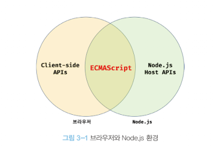

# 📖 3장. JS 개발환경과 실행 방법

---

 

### 1️⃣ JS 실행 환경

- **모든 브라우저는 자바스크립트를 해석하고 실행할 수 있는 자바스크립트 엔진을 내장하고 있으며, Node.js또한 자바스크립트 엔진을 내장하고 있습니다.**

**→ 따라서 자바스크립트는 브라우저 환경 또는 Node.js 환경에서 실행할 수 있습니다.**

**⚠️ 알아두어야 할점**

- **브라우저는 HTML, CSS, 자바스크립트를 실행하여 웹 페이지를 브라우저 화면에 렌더링하는 것이 주된 목적이지만, Node.js는 브라우저 외부에서 자바스크립트 실행 환경을 제공하는 것이 주된 목적입니다.**

**→ 브라우저와 Node.js는 자바스크립트의 코어인 ECMAScript를 실행할 수 있지만, 브라우저와 Node.js에서 ECMAScript 이외의 추가로 제공되는 기능은 호환되지 않습니다.**

**예시**

- **브라우저에서는 HTML 요소를 선택하거나 조작하는 기능의 집합인 DOM API를 기본적으로 제공하지만, Node.js는 DOM API를 제공하지 않습니다.**

**→ Node.js에서는 DOM API를 제공하지 않으므로 DOM 라이브러리를 사용해서 HTML문서를 가공해야 합니다.**

- **이와는 반대로 Node.js에서는 파일을 생성하고 수정할 수 있는 파일 시스템을 기본으로 제공하지만, 브라우저는 이를 지원하지 않습니다.**

**→ 브라우저를 통해 다운로드되어 실행되는 자바스크립트가 사용자 컴퓨터의 로컬 파일을 삭제하거나 수정하고 생성할 수 있다면 이는 사용자 컴퓨터가 악성 코드에 그대로 노출된 것과 마찬가지로, 보안상의 이유로 브라우저 환경의 자바스크립트는 파일 시스템을 제공하지 않습니다.**

### 2️⃣ 웹 브라우저

1. 개발자 도구
- 크롬 브라우저및 다른 브라우저는 개발자 도구를 기본적으로 내장되어 지원합니다.

**👉🏻 지원 기능**

| 패널 | 설명 |
| --- | --- |
| Elements | 로딩된 웹 페이지의 DOM과 CSS를 편집하여 렌더링된 뷰를 확인할 수 있습니다. |
| Console | 로딩된 웹페이지의 에러를 확인하거나, 자바스크립트 소스코드에 작성한 console.log 메서드의 실행결과를 확인할 수 있습니다. |
| Source | 로딩된 웹 페이지의 자바스크립트 코드를 디버깅할 수 있습니다. |
| Network | 로딩된 웹페이지에 관련된 요청 정보와 성능을 확인할 수 있습니다. |
| Application | 웹 스토리지, 세션, 쿠키를 확인하고 관리할 수 있습니다. |

### 3️⃣ Node.js

- 클라이언트 사이트, 즉 브라우저에서 동작하는 간단한 웹 어플리케이션은 브라우저만으로도 개발할 수 있습니다. 하지만 프로젝트의 규모가 커짐에 따라 React,Angular, Lodash 같은 프레임워크 또는 라이브러리를 도입하거나 Babel, Webpack,ESLint 등 여러 가지 도구를 사용할 필요가 있습니다.

**→ 이때 Node.js와 npm이 필요합니다.**

1. **Node.js와 npm 소개**
- 2009년, 라이언달이 발표한 Node.js는 크롬 V8 자바스크립트 엔진으로 빌드된 자바스크립트 런타임환경입니다.

**→ 즉, 브라우저에서만 동작하던 자바스크립트를 브라우저 이외의 환경에서 동작시킬 수 있는 자바스크립트 실행환경이 Node.js입니다.**

- **NPM은 자바스크립트 패키지 매니저입니다.**

**→ Node.js에서 사용할 수 있는 모듈들을 패키지화해서 모아둔 저장소 역할과 패키지 설치 및 관리를 위한 CLI를 제공 합니다.**

- **자신이 작성한 패키지를 공개할 수도 있고, 필요한 패키지를 검색해서 재사용할 수 있습니다.**